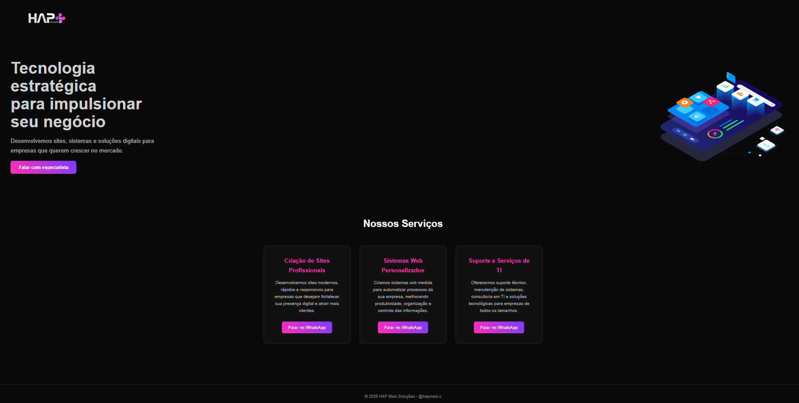

# 🌐 Site Institucional - Empresa de TI

Este projeto consiste no desenvolvimento de um site institucional para uma empresa especializada em **criação de sites** e **suporte técnico em Tecnologia da Informação (TI)**.

O objetivo é apresentar os serviços da empresa de forma profissional, moderna e acessível, fortalecendo sua presença digital e facilitando o contato com clientes.

---

## 🚀 Serviços oferecidos

- 💻 Desenvolvimento de sites profissionais  
- 📱 Sites responsivos (adaptados para celular e tablet)  
- 🛠️ Suporte técnico em TI  
- 🌐 Manutenção de sistemas e redes  
- 🔧 Consultoria tecnológica para empresas  

---

## 🎯 Objetivos do projeto

- Apresentar a empresa na internet  
- Atrair novos clientes  
- Demonstrar profissionalismo e credibilidade  
- Facilitar o contato com clientes  

---

## 🧰 Tecnologias utilizadas

- HTML5  
- CSS3  
- JavaScript  

---

## 📸 Preview do projeto



---

## 🔗 Acesse o projeto


---

## 📂 Como usar

1. Clone este repositório:
   ```bash
   git clone https://github.com/adoglesio/hapmaiss.git
   ```

2. Abra o arquivo `index.html` no navegador.

---

## 📞 Contato

- 📧 Email: hapmaiss@gmail.com
- 📱 WhatsApp: (73) 99925-7758

---

## 📌 Status do projeto

🚧 Em desenvolvimento  

---

## 🧑‍💻 Autor

Desenvolvido por me 💪

# hapmaiss
